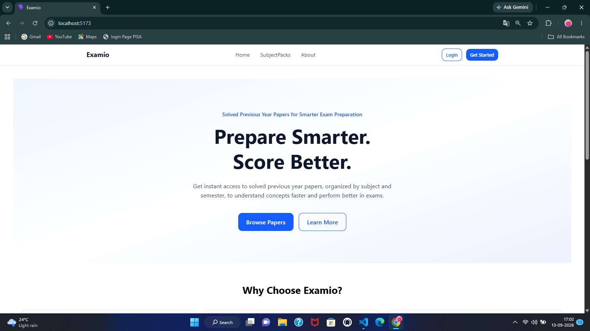
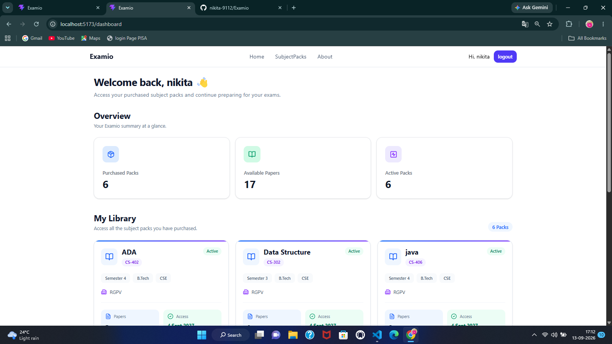
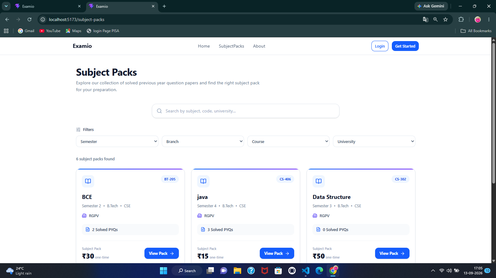
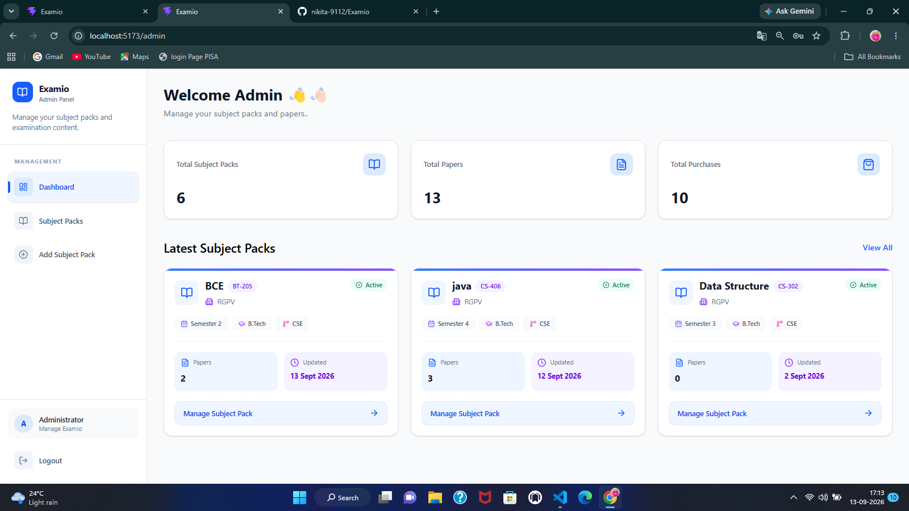
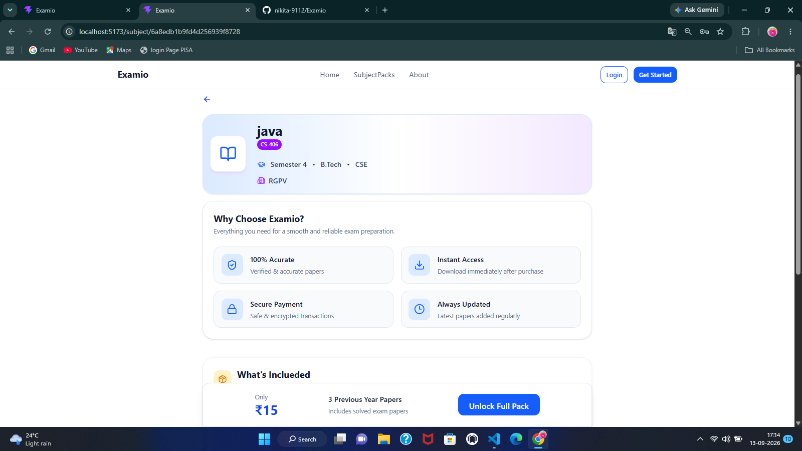

# Examio

> A full-stack examination resource platform for discovering,
> purchasing, and securely accessing subject-wise previous-year question
> papers.

Examio is a full-stack web application designed to make academic
question papers easier to discover, purchase, manage, and access.
Students can browse subject packs, preview demo PDFs, purchase access
through Razorpay, and view their purchased papers. Administrators can
manage subject packs and papers through a dedicated admin dashboard.

------------------------------------------------------------------------

## ✨ Features

### 👨‍🎓 Student Features

-   User registration and login
-   Google authentication
-   Forgot-password and password-reset flow
-   JWT-based authentication
-   Browse available subject packs
-   Search and filter subject packs
-   View subject-pack details
-   View demo PDF before purchasing
-   Purchase subject packs using Razorpay
-   Payment verification
-   Check purchase/access status
-   Student dashboard
-   Personal library of purchased subject packs
-   Secure access to purchased papers
-   Protected PDF/question-paper viewer
-   Responsive user interface
-   Toast notifications and loading/error states

### 🛠️ Admin Features

-   Separate admin dashboard
-   Admin-only protected routes
-   Dashboard statistics
-   View all subject packs
-   Create subject packs
-   Edit subject packs
-   Activate/deactivate subject packs
-   Delete subject packs
-   Add papers to subject packs
-   Delete papers from subject packs
-   Upload PDF files
-   Store uploaded files using Cloudinary
-   View protected papers from the admin side
-   Manage papers for individual subject packs

### 🔐 Authentication & Authorization

-   JWT authentication
-   Protected routes
-   Role-based authorization
-   Student and admin roles
-   Google OAuth-based login
-   Password reset using email
-   Password hashing with bcryptjs
-   Middleware-based access control

### 💳 Payments

-   Razorpay payment gateway
-   Server-side order creation
-   Payment verification
-   Purchase status tracking
-   Purchase expiry support
-   Access control based on valid purchase

### ☁️ File Management

-   PDF uploads through Multer
-   Cloudinary integration for file storage
-   Demo PDF support
-   Protected access to purchased papers
-   Paper metadata stored with subject packs

------------------------------------------------------------------------

## 🏗️ Tech Stack

### Frontend

  Technology     Purpose
  -------------- ---------------------------
  React 19       UI development
  Vite           Frontend build tool
  React Router   Client-side routing
  Tailwind CSS   Styling and responsive UI
  Axios          API communication
  Lucide React   Icons
  React PDF      PDF rendering
  Oxlint         Linting

### Backend

  Technology            Purpose
  --------------------- ---------------------------
  Node.js               Runtime
  Express               REST API
  MongoDB               Database
  Mongoose              MongoDB ODM
  JWT                   Authentication
  bcryptjs              Password hashing
  Google Auth Library   Google authentication
  Razorpay              Payments
  Cloudinary            PDF/file storage
  Multer                File uploads
  Nodemailer            Password-reset emails
  CORS                  Cross-origin requests
  Slugify               Subject-pack slugs
  Dotenv                Environment configuration

------------------------------------------------------------------------

## 📁 Project Structure

``` text
Examio/
│
├── frontend/
│   ├── public/
│   │
│   ├── src/
│   │   ├── admin/
│   │   │   ├── components/
│   │   │   ├── contex/
│   │   │   ├── hooks/
│   │   │   ├── layouts/
│   │   │   ├── model/
│   │   │   ├── pages/
│   │   │   └── services/
│   │   │
│   │   ├── components/
│   │   │   ├── dashboard/
│   │   │   ├── subject/
│   │   │   └── ui/
│   │   │
│   │   ├── context/
│   │   ├── hooks/
│   │   ├── layouts/
│   │   ├── pages/
│   │   ├── routes/
│   │   ├── sevices/
│   │   ├── utils/
│   │   ├── App.jsx
│   │   ├── App.css
│   │   └── index.css
│   │
│   ├── package.json
│   └── vite.config.js
│
├── backend/
│   ├── config/
│   │   ├── cloudinary.js
│   │   ├── db.js
│   │   └── razorpay.js
│   │
│   ├── controllers/
│   │   ├── adminControllers.js
│   │   ├── authControllers.js
│   │   ├── purchaseController.js
│   │   ├── subjectPactController.js
│   │   └── uploadController.js
│   │
│   ├── middleware/
│   │   ├── adminMiddleware.js
│   │   ├── authMiddleware.js
│   │   ├── hasPackAccess.js
│   │   └── uploadMiddleware.js
│   │
│   ├── models/
│   │   ├── PurchaseModel.js
│   │   ├── SubjectPack.js
│   │   └── User.js
│   │
│   ├── routes/
│   │   ├── adminRoutes.js
│   │   ├── authRoutes.js
│   │   ├── purchaseRoutes.js
│   │   ├── subjectPackRoutes.js
│   │   └── uploadRoutes.js
│   │
│   ├── seeders/
│   │   └── adminSeeder.js
│   │
│   ├── utils/
│   ├── package.json
│   └── server.js
│
└── README.md
```

------------------------------------------------------------------------

## 🔄 Application Flow

``` text
                         ┌─────────────────┐
                         │     Examio      │
                         └────────┬────────┘
                                  │
                    ┌─────────────┴─────────────┐
                    │                           │
                 Student                      Admin
                    │                           │
          ┌─────────┴─────────┐       ┌─────────┴─────────┐
          │                   │       │                   │
       Browse             Dashboard  Dashboard       Manage Packs
          │                   │       │                   │
       Subject                │       │             Manage Papers
          │                   │       │                   │
      Demo PDF           My Library  │             Upload PDFs
          │                   │       │                   │
       Purchase              │       │            Activate / Delete
          │                   │       │
       Razorpay               │       │
          │                   │       │
       Payment ───────────────┘       │
          │                           │
      Verify Payment                  │
          │                           │
    Access Purchased Papers ◄─────────┘
```

------------------------------------------------------------------------

## 🔑 Authentication Flow

### Local Authentication

``` text
Register
   ↓
Password hashed with bcryptjs
   ↓
User stored in MongoDB
   ↓
Login
   ↓
JWT generated
   ↓
Token stored on frontend
   ↓
Protected API requests
```

### Google Authentication

``` text
Google Login
     ↓
Google credential verification
     ↓
Find/Create User
     ↓
JWT generated
     ↓
Authenticated application session
```

------------------------------------------------------------------------

## 💰 Purchase Flow

``` text
Student selects Subject Pack
          ↓
Check purchase/access
          ↓
Create Razorpay Order
          ↓
Open Razorpay Checkout
          ↓
Payment completed
          ↓
Verify payment on backend
          ↓
Create/Update Purchase
          ↓
Access granted
          ↓
Purchased papers available
```

The backend verifies the payment before granting access to protected
papers.

------------------------------------------------------------------------

## 📚 Subject Pack Structure

A subject pack contains academic information such as:

-   University
-   Course
-   Branch
-   Semester
-   Subject code
-   Subject name
-   Description
-   Price
-   Thumbnail
-   Demo PDF
-   Active/inactive status
-   Collection of question papers
-   Creator
-   Creation/update timestamps

Each paper can contain:

-   Exam year
-   Exam type
-   File name
-   PDF URL
-   Cloudinary public ID
-   Upload timestamp

------------------------------------------------------------------------

## 🔒 Protected Paper Access

Examio does not expose purchased question papers through an unrestricted
public student route.

The backend uses authentication and pack-access middleware before
returning protected papers.

``` text
Student Request
      ↓
JWT Authentication
      ↓
Verify User
      ↓
Check Subject Pack Purchase
      ↓
Check Access/Expiry
      ↓
Return Protected Paper
```

Administrators have separate protected routes for managing and viewing
papers.

------------------------------------------------------------------------

## 🌐 API Overview

The backend exposes REST API routes under `/api`.

### Authentication

``` text
POST   /api/auth/register
POST   /api/auth/login
GET    /api/auth/me
POST   /api/auth/google
POST   /api/auth/forgot-password
POST   /api/auth/reset-password/:token
```

### Subject Packs

``` text
GET    /api/subject-packs
GET    /api/subject-packs/:id

POST   /api/subject-packs
PUT    /api/subject-packs/:id
DELETE /api/subject-packs/:id

POST   /api/subject-packs/:id/papers
DELETE /api/subject-packs/:packId/papers/:paperId
```

Creation, update, deletion, and paper-management endpoints require admin
authorization.

### Purchases

``` text
POST   /api/v1/purchase/create
PUT    /api/v1/purchase/complete
PUT    /api/v1/purchase/failed

GET    /api/v1/purchase/my-purchases
GET    /api/v1/purchase/access/:subjectPackId

POST   /api/v1/purchase/create-order
POST   /api/v1/purchase/verify-payment

GET    /api/v1/purchase/full-papers/:subjectPackId
GET    /api/v1/purchase/paper/:subjectPackId/:paperId
```

### Admin

``` text
GET    /api/admin/dashboard
GET    /api/admin/dashboard/stats

GET    /api/admin/subject-packs
GET    /api/admin/subject-pack/:id

GET    /api/admin/paper/:subjectPackId/:paperId
```

### File Upload

``` text
POST   /api/upload/pdf
```

PDF upload requires authenticated admin access.

------------------------------------------------------------------------

## ⚙️ Environment Variables

Create a `.env` file inside the `backend` directory.

``` env
PORT=5000

MONGO_URL=your_mongodb_connection_string

JWT_SECRET=your_jwt_secret

GOOGLE_CLIENT_ID=your_google_client_id

RAZORPAY_KEY_ID=your_razorpay_key_id
RAZORPAY_KEY_SECRET=your_razorpay_key_secret

CLOUDINARY_CLOUD_NAME=your_cloudinary_cloud_name
CLOUDINARY_API_KEY=your_cloudinary_api_key
CLOUDINARY_API_SECRET=your_cloudinary_api_secret

EMAIL_USER=your_email
EMAIL_PASS=your_email_password_or_app_password

FRONTEND_URL=http://localhost:5173
```

For the frontend, create a `.env` file inside `frontend`:

``` env
VITE_API_URL=http://localhost:5000
VITE_GOOGLE_CLIENT_ID=your_google_client_id
VITE_RAZORPAY_KEY_ID=your_razorpay_key_id
```

> Never commit real credentials, API keys, secrets, or `.env` files to
> GitHub.

------------------------------------------------------------------------

## 🚀 Getting Started

### 1. Clone the repository

``` bash
git clone https://github.com/your-username/examio.git
cd examio
```

Replace `your-username/examio` with your actual GitHub repository URL.

------------------------------------------------------------------------

### 2. Backend Setup

Navigate to the backend:

``` bash
cd backend
```

Install dependencies:

``` bash
npm install
```

Create your `.env` file and configure the required environment
variables.

Start the development server:

``` bash
npm run dev
```

The backend runs on:

``` text
http://localhost:5000
```

You can check the API root at:

``` text
http://localhost:5000/
```

Expected response:

``` text
Examio API Running
```

------------------------------------------------------------------------

### 3. Frontend Setup

Open another terminal and navigate to the frontend:

``` bash
cd frontend
```

Install dependencies:

``` bash
npm install
```

Create the frontend `.env` file and add the required variables.

Start the Vite development server:

``` bash
npm run dev
```

The frontend normally runs at:

``` text
http://localhost:5173
```

------------------------------------------------------------------------

## 👑 Creating an Admin

The backend includes an admin seeder.

From the `backend` directory, run:

``` bash
npm run seed-admin
```

Make sure the seeder configuration is appropriate for your local
environment before running it.

------------------------------------------------------------------------

## 🧪 Available Scripts

### Backend

``` bash
npm run dev
```

Starts the backend using Nodemon.

``` bash
npm start
```

Starts the backend using Node.js.

``` bash
npm run seed-admin
```

Runs the admin seeder.

------------------------------------------------------------------------

### Frontend

``` bash
npm run dev
```

Starts the Vite development server.

``` bash
npm run build
```

Creates a production build.

``` bash
npm run preview
```

Previews the production build locally.

``` bash
npm run lint
```


------------------------------------------------------------------------

## 🖥️ Main Frontend Routes

### Public

``` text
/
 /login
 /register
 /forgot-password
 /reset-password/:token
 /subject-packs
 /subject/:id
 /about
```

### Student

``` text
/dashboard
/paper/:subjectPackId/:paperId
```

### Admin

``` text
/admin
/admin/subject-packs
/admin/subject-packs/:id
/admin/subject-packs/:id/manage-paper
/admin/subject-packs/:id/edit
/admin/subject-pack/new
/admin/subject-pack/new-demo
```

Admin routes are protected using role-based route protection.

------------------------------------------------------------------------

## 🗄️ Database Models

Examio currently uses three main MongoDB models.

### User

Stores:

-   Name
-   Email
-   Password
-   Authentication provider
-   Google ID
-   Role
-   Password-reset information
-   Purchase references
-   Timestamps

Roles:

``` text
student
admin
```

### SubjectPack

Stores:

-   University
-   Course
-   Branch
-   Semester
-   Subject code
-   Subject name
-   Slug
-   Description
-   Price
-   Thumbnail
-   Demo PDF
-   Active status
-   Papers
-   Creator
-   Timestamps

### Purchase

Stores:

-   User
-   Subject pack
-   Amount
-   Payment provider
-   Razorpay order ID
-   Payment ID
-   Purchase status
-   Purchase date
-   Expiry date
-   Timestamps

------------------------------------------------------------------------

## ☁️ External Services

Examio integrates with several external services.

### MongoDB

Used as the primary application database.

### Cloudinary

Used for storing uploaded PDF files and associated file metadata.

### Razorpay

Used for handling subject-pack payments.

### Google

Used for Google authentication.

### Nodemailer

Used for sending password-reset emails.

------------------------------------------------------------------------

## 🔐 Security Considerations

Examio uses multiple layers of access control:

-   Password hashing with bcryptjs
-   JWT authentication
-   Protected API routes
-   Role-based admin authorization
-   Purchase/access middleware
-   Server-side payment verification
-   Environment variables for sensitive configuration
-   Cloudinary-based file storage
-   Validation of MongoDB ObjectIds in relevant backend utilities

For production deployment, additional security hardening should be
applied, including secure CORS configuration, production secrets, HTTPS,
rate limiting, stronger validation, and appropriate logging/monitoring.

------------------------------------------------------------------------

## 📸 Screenshots

Screenshots can be added here as the UI is finalized.

Suggested sections:

### Home Page

``` text

```

### Student Dashboard

``` text

```

### Subject Pack

``` text

```

### Admin Dashboard

``` text

```

### Subject Pack Management

``` text

```

------------------------------------------------------------------------

## 🛣️ Future Improvements

Some possible improvements for future versions:

-   [ ] Automated testing
-   [ ] API documentation with Swagger/OpenAPI
-   [ ] More advanced search and filtering
-   [ ] Better analytics for administrators
-   [ ] Order/payment history UI
-   [ ] Improved admin reporting
-   [ ] Email notifications for purchases
-   [ ] Pagination for large collections
-   [ ] More robust file validation
-   [ ] Rate limiting and security hardening
-   [ ] Automated CI/CD pipeline
-   [ ] Improved PDF viewer controls
-   [ ] User profile management
-   [ ] Better mobile-first optimizations

------------------------------------------------------------------------

## 🤝 Contributing

Contributions, suggestions, and improvements are welcome.

To contribute:

``` bash
# Fork the repository

# Create a new branch
git checkout -b feature/your-feature

# Make your changes

# Commit your changes
git commit -m "Add: your feature"

# Push your branch
git push origin feature/your-feature
```

Then open a Pull Request.

------------------------------------------------------------------------

## 📄 License

This project currently uses the ISC license as specified in the backend
package configuration.

------------------------------------------------------------------------

## 👩‍💻 Author

**Nikita Choudhary**

Built as a full-stack web application for providing organized and
accessible academic question-paper resources.

------------------------------------------------------------------------

## ⭐ Support

If you find this project useful, consider giving the repository a ⭐ on
GitHub.
